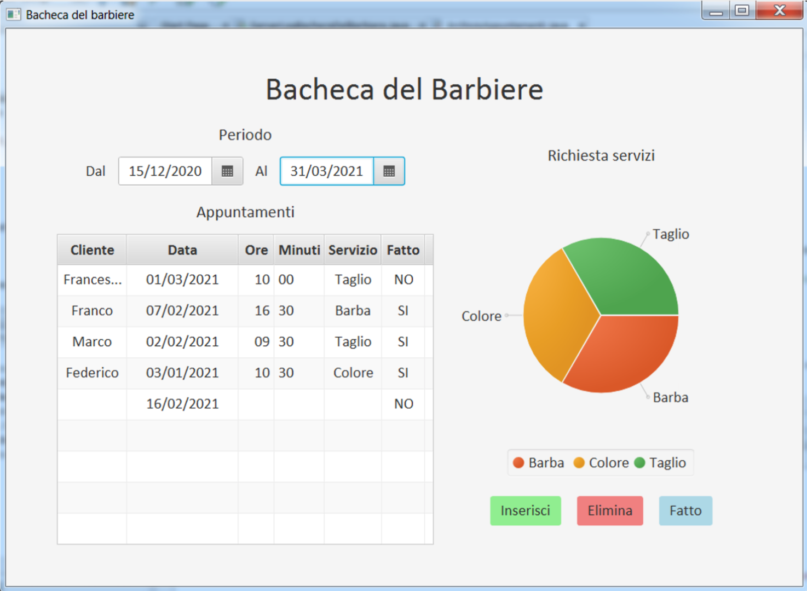

# BachecaDelBarbiere

BachecaDelBarbiere is a simple JavaFX application where a barber can organize and maintain customers appointments information.

[Here](documentazione.pdf) (in Italian) is present the documentation of the project.

## Goals are:
- To create a JavaFX application programming the grafic user interface and studing grafic components (without GUI generator softwares)
- To maintain a front-end/middleware/backend division in the classes structure
- To develop a good quality code
- To store data on MySQL database
- To create a log server

## Repository structure
 - `BachecaDelBarbiere`: JavaFX application
 - `ServerLogBachecaDelBarbiere`: log server that register the user actions

## Preview

   

